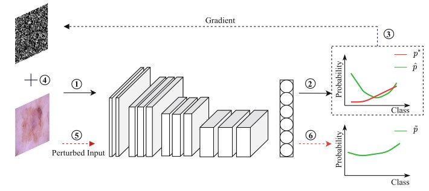

# Gradient Pertub
This repo is the implementation of *Alleviating Data Imbalance Issue with Perturbed Input During Inference* [paper](https://link.springer.com/chapter/10.1007/978-3-030-87240-3_39) 

## Method


## Train
The training config is setting in the file of param.json
```
python main.py --model_dir ./experiments/example
```

## Evaluation
After the model is well-trained, the model is stored in the experiments. When evaluate the model, we add gradient perturbation with small magnitube (e.g., 0.001).
```
python evaluate.py --model_dir ./experiments/example --epsilon 0.001
```

## Citation
```
@inproceedings{chen2021alleviating,
  title={Alleviating Data Imbalance Issue with Perturbed Input During Inference},
  author={Chen, Kanghao and Mao, Yifan and Lu, Huijuan and Zeng, Chenghua and Wang, Ruixuan and Zheng, Wei-Shi},
  booktitle={International Conference on Medical Image Computing and Computer-Assisted Intervention},
  pages={407--417},
  year={2021},
  organization={Springer}
}
```